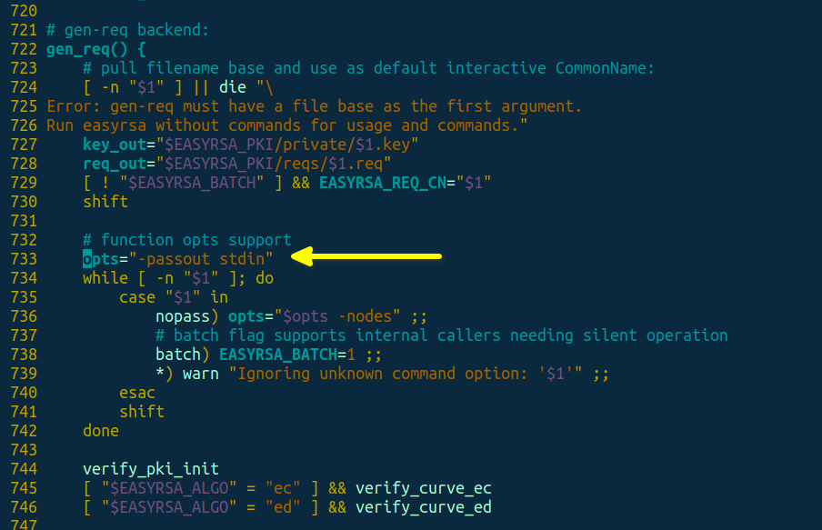
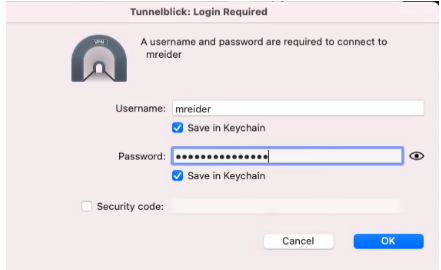
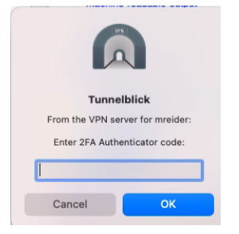
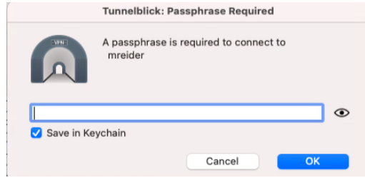

# OpenVPN Community for Amazon Linux 2 + 2FA with Google Authenticator

#### Table of contents
1. [Installing](#installing)
2. [Additional setup](#additional-setup)
   1. [OpenVPN config template](#openvpn-config-template)
   2. [Code name in Google Authenticator](#code-name-in-google-authenticator)
3. [Adding/removing/list users](#addingremovinglist-users)
   1. [Adding](#adding)
   2. [Removing](#removing)
   3. [List of users](#list-of-users)
4. [Paths](#paths)
5. [Services](#services)
6. [Uninstall](#uninstall)
7. [Client connection](#client-connection)
   1. [Mac OS](#mac-os)
   2. [Linux](#linux)
8. [Credits & Licence](#credits--licence)

## Installing

First, get the script and make it executable:

```
curl -O https://raw.githubusercontent.com/danilvalov/openvpn_amazon_linux_2fa/master/install-openvpn.sh
chmod +x install-openvpn.sh
```
Then run it as root:
```
./install-openvpn.sh
```

And the last step:

Open `/etc/openvpn/easy-rsa/easyrsa` file, find the function called `gen_req()` (should be around line 722, depending on your EasyRSA version) and change a parameter called `opts=` to `opts="-passout stdin"` like here:



## Additional setup

### OpenVPN config template

If you want to change OpenVPN user config template, just open `/etc/openvpn/client-template.txt` file and modify it.

### Code name in Google Authenticator

You can change name of code in Google Authenticator in generating QR codes. Just modify `ISSUER="OpenVPN"` line in the top of `manage-openvpn.sh` file to `ISSUER="Your Project Name"`.

## Adding/removing/list users

### Adding
 
Run a command
```
./manage-openvpn.sh create fred
```
to generate OpenVPN config for some Fred.

**Important:** save username, password and emergency scratch codes from your terminal! You won't be able to see it again in the future for generated user!

### Removing

Run a command
```
./manage-openvpn.sh revoke fred
```
to revoke access to Fred

### List of users

Run a command
```
./manage-openvpn.sh status
```
to see list of created OpenVPN users

## Paths

You can find generated OpenVPN configs of users in the following directory: `/opt/openvpn/clients`.

You can find QR codes and secret keys for 2FA of users here: `/opt/openvpn/google-auth`.

## Services

Installation script adds 2 daemons to the system:
1. `openvpn@server` - start/stop/status of OpenVPN server. You can manage it using systemctl: `systemctl status openvpn@server`.
2. `iptables-openvpn` - adding/removing iptables configs for OpenVPN (sharing port and other), you can find detailed iptables rules here after installation: `/etc/iptables/add-openvpn-rules.sh`. You can manage this service using systemctl: `systemctl status iptables-openvpn`.

## Uninstall

Run a command
```
./install-openvpn.sh
```
and select `Remove OpenVPN` option

## Client connection

### Mac OS

Add generated OpenVPN config from `/opt/openvpn/clients/CLIENTNAME` directory to your VPN client (ie, Tunnelblick, etc), enter username and password:



Next get a 2FA code from Authy or Google Authenticator apps:



And finally enter a private key passphrase (same as password):



### Linux

On an Ubuntu-based distro, there currently is no GUI for 2FA authentication with OpenVPN. If you try to use the Network Manager to create a new VPN connection, it won't be able to connect since it will get stuck waiting for 2FA code.

The only workable way is to connect via command line,

Place your `.ovpn` file into `~/vpn`

Open your `.ovpn` profile and add these lines

```
auth-user-pass client.pass
askpass client.priv
script-security 2
up /etc/openvpn/update-resolv-conf
down /etc/openvpn/update-resolv-conf
down-pre
```

This will query the `client.pass` and `client.priv` files every time you connect w/out prompting you to constantly enter your VPN password.

Open up `client.pass` file and enter your username + password:
```
jsmith
xverDF8@9df:!
```

Change rules for this file:
```
chown $(whoami):$(whoami) && chmod 600 client.pass
```

Edit `client.priv` file, and enter just your password, ie:
```
xverDF8@9df:!
```

Run same chown and chmod on this file.

Now connect to VPN server form command line:
```
cd ~/vpn/
sudo openvpn --config jsmith.ovpn
```

The client will ask for your 2FA code:
```
Tue Apr 26 09:51:04 2022 OpenVPN 2.4.7 x86_64-pc-linux-gnu [SSL (OpenSSL)] [LZO] [LZ4] [EPOLL] [PKCS11] [MH/PKTINFO] [AEAD] built on Mar 22 2022
Tue Apr 26 09:51:04 2022 library versions: OpenSSL 1.1.1f  31 Mar 2020, LZO 2.10
CHALLENGE: Enter 2FA Authenticator code: 
```

Enter the code from your Authy app, you should now be connected. VPN password and private key password are seamless as they are stored and read from `client.pass` and `client.priv` files.

## Credits & Licence

Thank [Mike Reider](https://github.com/perfecto25) for [his article about OpenVPN+2FA](https://perfecto25.medium.com/openvpn-community-2fa-with-google-authenticator-4f2a7cb08128) and [his OpenVPN+2FA repository for Rocky Linux 8](https://github.com/perfecto25/openvpn_2fa). I just modified it a bit to make this script and this README file.

Thank [Stanislas](https://github.com/angristan) for [his OpenVPN repository](https://github.com/angristan/openvpn-install).

Many thanks to Nyr's original work.

This project is under the [MIT Licence](https://raw.githubusercontent.com/danilvalov/openvpn_amazon_linux_2fa/master/LICENSE)
